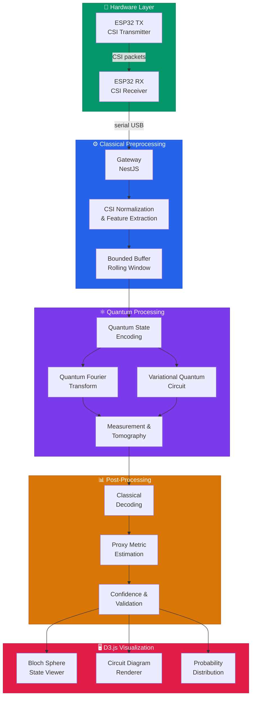
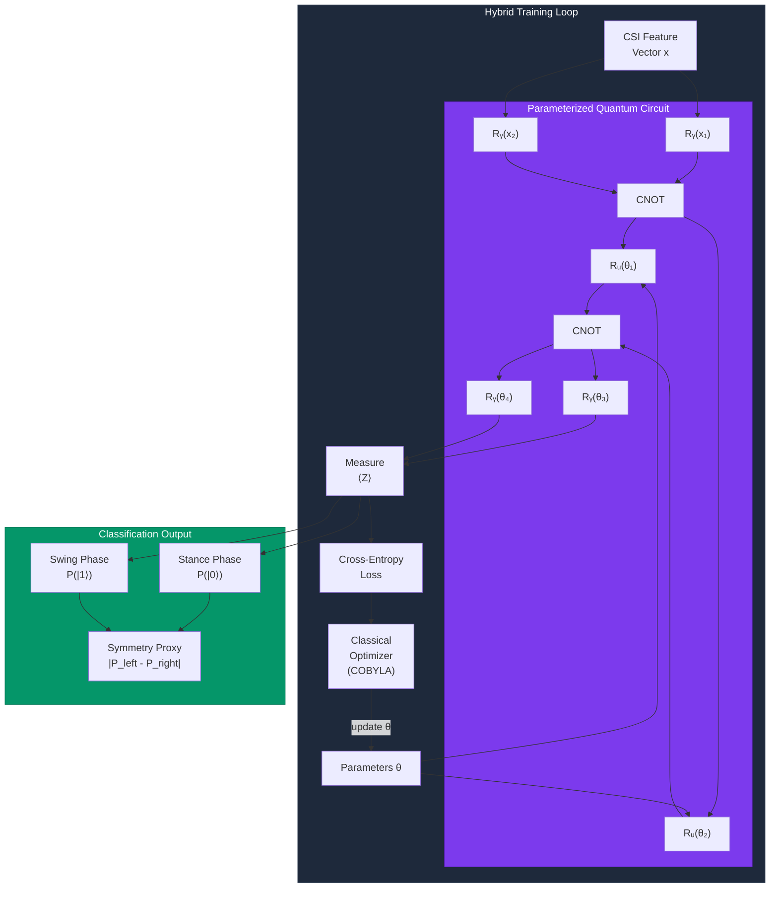
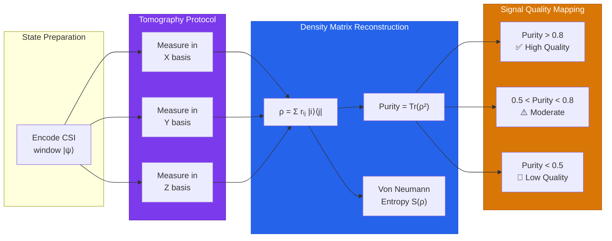
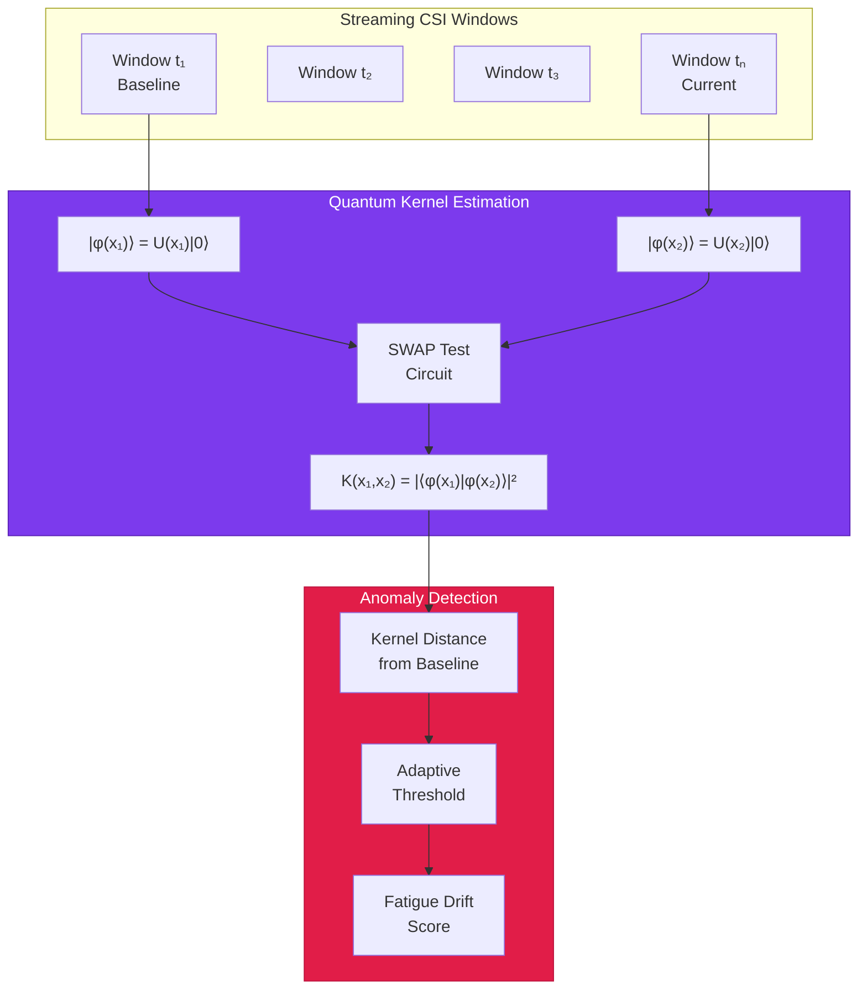
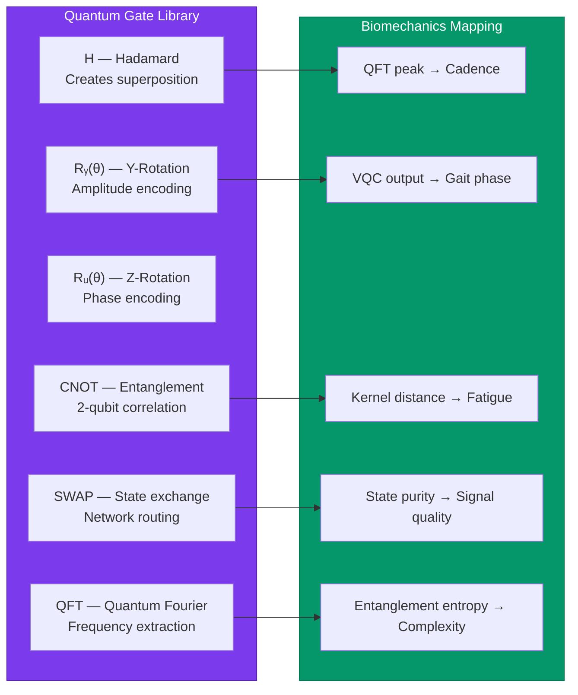

# Biomechanics RadioFrequency Platform

Professional treadmill running biomechanics analytics powered by ESP32 Wi-Fi CSI sensing.

## What is this?

A station-based treadmill analytics platform that uses Wi-Fi Channel State Information (CSI) from affordable ESP32 hardware to estimate running biomechanics proxy metrics in real time — without cameras, wearables, or force plates.

> **Scientific honesty notice:** This system estimates motion from radio-frequency measurements. Front, rear, and lateral motion views are **synthetic renderings of an inferred body model**, not camera footage. Every metric includes confidence and validation status.

## Architecture

```
┌──────────┐    serial    ┌──────────┐   websocket   ┌──────────┐
│ ESP32 TX │───────────── │ Gateway  │──────────────── │  Web UI  │
│ ESP32 RX │    USB       │ (NestJS) │                │ (Next.js)│
└──────────┘              └────┬─────┘                └──────────┘
                               │ HTTP
                          ┌────▼─────┐
                          │ Backend  │
                          │ (Spring) │
                          └────┬─────┘
                          ┌────▼─────┐
                          │PostgreSQL│
                          └──────────┘
```

| Layer | Stack | Purpose |
|-------|-------|---------|
| **firmware/** | ESP-IDF / C | ESP32 CSI transmitter + receiver |
| **apps/gateway/** | NestJS / TypeScript | Serial ingestion, realtime metrics, WebSocket streaming |
| **apps/backend/** | Spring Boot / Java 21 | Domain API, persistence, auth, validation |
| **apps/web/** | Next.js / React / TypeScript | Operator dashboard, live sessions, replay, reports |
| **ml/** | Python 3.11 / PyTorch | Proxy metric models, optional pose inference |

## Quick Start

```bash
# 1. Clone and setup
git clone <repo-url> && cd biomechanics-radiofrequency
cp .env.example .env

# 2. Start database
make db-up

# 3. Start backend
make backend

# 4. Start gateway (demo mode if no ESP32 connected)
DEMO_MODE=true make gateway

# 5. Start web UI
make web

# 6. Open browser
open http://localhost:3000
```

## v1 Metrics

| Metric | Type | Description |
|--------|------|-------------|
| Cadence | Proxy | Steps per minute estimated from CSI periodicity |
| Step Interval | Proxy | Time between consecutive steps |
| Step Interval Variability | Proxy | Consistency of step timing |
| Symmetry Proxy | Proxy | Left/right step balance estimation |
| Contact Time Proxy | Proxy | Estimated ground contact duration |
| Flight Time Proxy | Proxy | Estimated aerial phase duration |
| Fatigue Drift Score | Derived | Trend in metric degradation over time |
| Signal Quality Score | Direct | CSI packet rate and signal stability |
| Model Confidence | Derived | Overall trust in current estimates |

## Output Classes (never mix these)

1. **Direct signal measurements** — CSI packets, RSSI, packet rate
2. **Derived proxy metrics** — cadence, symmetry proxy, contact-time proxy
3. **Inferred motion outputs** — 2D keypoints, 3D skeleton, synthetic renders

## Validation States

- `unvalidated` — no external reference comparison
- `experimental` — early-stage, limited testing
- `station_validated` — verified against station baseline
- `externally_validated` — compared against gold-standard reference

## Quantum Computation Layer

The platform explores quantum-enhanced signal processing and machine learning to push the boundaries of Wi-Fi CSI biomechanics estimation. Quantum routines run as hybrid classical-quantum pipelines — the classical gateway preprocesses CSI data, quantum circuits extract features or optimize model parameters, and results feed back into the standard metric pipeline.

### Quantum Architecture Overview



### Quantum Signal Processing Pipeline

The CSI subcarrier amplitudes are encoded into quantum states via amplitude encoding. A Quantum Fourier Transform (QFT) extracts periodic gait features (cadence, step intervals) with exponential speedup over classical DFT for high-dimensional subcarrier spaces.

```mermaid
flowchart LR
    subgraph Input["CSI Input"]
        RAW["Raw CSI<br/>52 subcarriers × N frames"]
    end

    subgraph Encode["Amplitude Encoding"]
        direction TB
        A1["|ψ⟩ = Σ αᵢ|i⟩"]
        A2["Normalize amplitudes<br/>to unit vector"]
        A3["Log₂(52) ≈ 6 qubits<br/>per frame"]
    end

    subgraph QFT_Block["Quantum Fourier Transform"]
        direction TB
        H["Hadamard<br/>Gates"]
        CR["Controlled<br/>Rotation"]
        SW["SWAP<br/>Network"]
        Q1["Extract gait<br/>periodicity"]
    end

    subgraph Measure["Measurement"]
        direction TB
        M1["Computational<br/>basis measurement"]
        M2["Frequency bin<br/>probabilities"]
        M3["Peak detection<br/>→ cadence estimate"]
    end

    RAW --> A2 --> A1 --> A3
    A3 --> H --> CR --> SW --> Q1
    Q1 --> M1 --> M2 --> M3

    style QFT_Block fill:#7c3aed,stroke:#5b21b6,color:#fff
    style Encode fill:#2563eb,stroke:#1d4ed8,color:#fff
    style Measure fill:#d97706,stroke:#b45309,color:#fff
```



### Variational Quantum Classifier (VQC) for Gait Phase Detection

A parameterized quantum circuit classifies gait phases (stance vs. swing, left vs. right) from CSI feature vectors. The circuit is trained with a classical optimizer in a hybrid loop.



### Quantum State Tomography for Signal Quality Assessment

Quantum state tomography reconstructs the density matrix ρ of the encoded CSI signal. The purity Tr(ρ²) serves as a quantum-derived signal quality indicator — high purity means coherent gait signal, low purity indicates noise or multi-person interference.



### Quantum-Enhanced Anomaly Detection (Fatigue Drift)

A quantum kernel method maps CSI time series into a high-dimensional Hilbert space where gait degradation patterns become linearly separable. The quantum kernel $K(x_i, x_j) = |\langle\phi(x_i)|\phi(x_j)\rangle|^2$ captures nonlinear fatigue signatures that classical kernels miss.



### D3.js Interactive Visualizations

The web frontend (`apps/web`) includes D3.js-powered interactive visualizations for the quantum computation layer, available in the observatory dashboard:

| Visualization | D3.js Component | Description |
|--------------|-----------------|-------------|
| **Bloch Sphere** | `d3-bloch-sphere` | 3D interactive qubit state visualization with rotation and zoom |
| **Circuit Diagram** | `d3-quantum-circuit` | Gate-level circuit rendering with depth and qubit annotations |
| **Probability Histogram** | `d3-prob-distribution` | Measurement outcome probabilities with confidence intervals |
| **Kernel Heatmap** | `d3-kernel-matrix` | Quantum kernel similarity matrix with fatigue drift highlighting |
| **Purity Timeline** | `d3-purity-chart` | Real-time quantum purity (signal quality) over session duration |
| **State Tomography** | `d3-density-matrix` | Density matrix magnitude visualization as color-mapped grid |

### Quantum Circuit Notation Reference



### Running Quantum Experiments

```bash
# Run quantum simulation locally (no quantum hardware needed)
cd ml && python -m quantum.simulate --input sample_csi.npy

# Train variational quantum classifier
cd ml && python -m quantum.train_vqc --epochs 50 --qubits 6

# Evaluate quantum kernel anomaly detection
cd ml && python -m quantum.eval_kernel --baseline session_001.npy --test session_042.npy

# Export quantum circuit to OpenQASM 3.0
cd ml && python -m quantum.export_qasm --circuit vqc_gait --output circuit.qasm
```

> **Note:** Quantum routines run on simulators by default. For real quantum hardware execution via IBM Quantum or Azure Quantum, configure credentials in `.env`. All quantum-derived metrics carry an `experimental` validation status until externally validated.

---

## Documentation

See [docs/](docs/) for detailed guides:

- [Architecture](docs/architecture.md)
- [Product Scope](docs/product_scope.md)
- [Quantum & Bloch Sphere Analysis](docs/quantum_bloch_sphere_analysis.md)
- [Sensing Limitations](docs/sensing_limitations.md)
- [Inferred Views](docs/inferred_views.md)
- [Hardware Setup](docs/hardware_setup.md)
- [Calibration Protocol](docs/calibration_protocol.md)
- [Validation Workflow](docs/validation_workflow.md)
- [Privacy & Security](docs/privacy_and_security.md)

## License

MIT — see [LICENSE](LICENSE)
