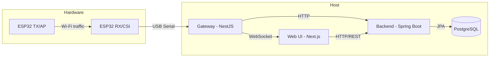
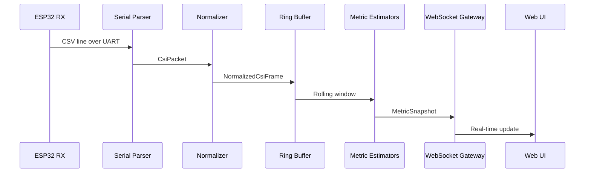
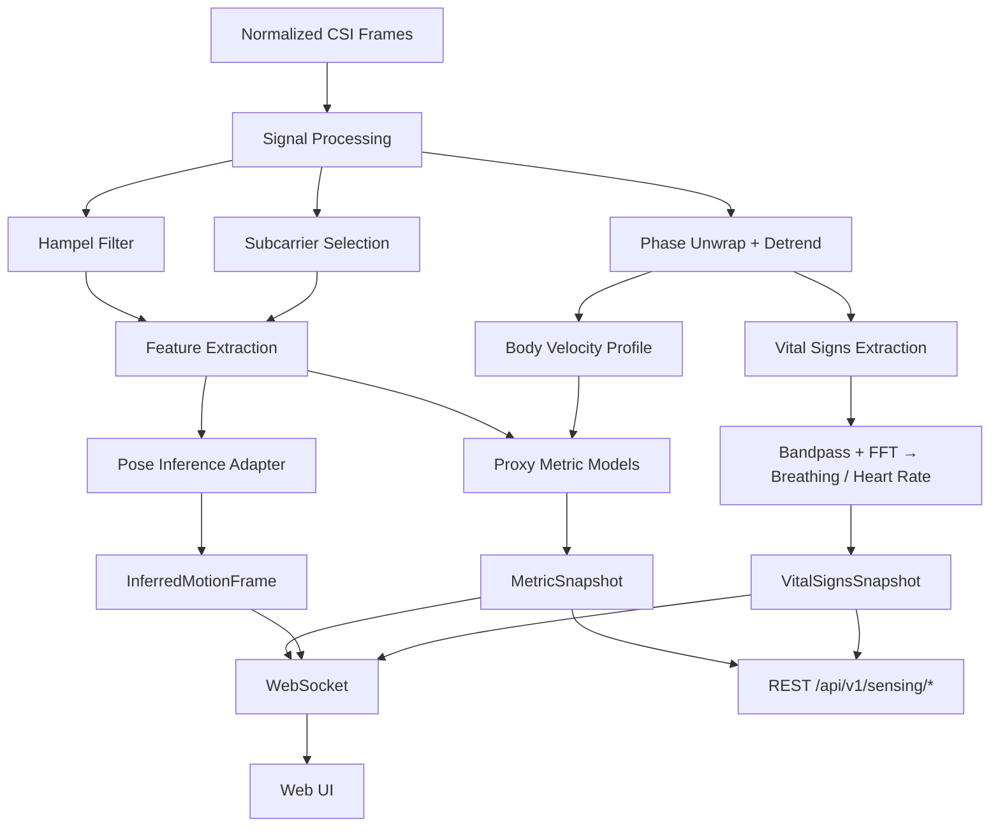
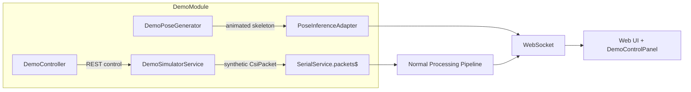
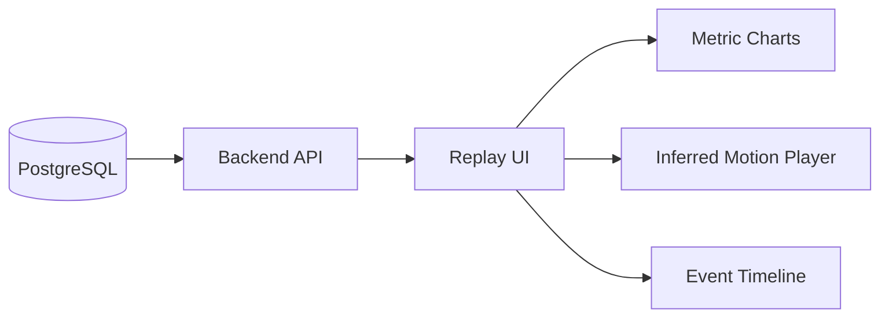
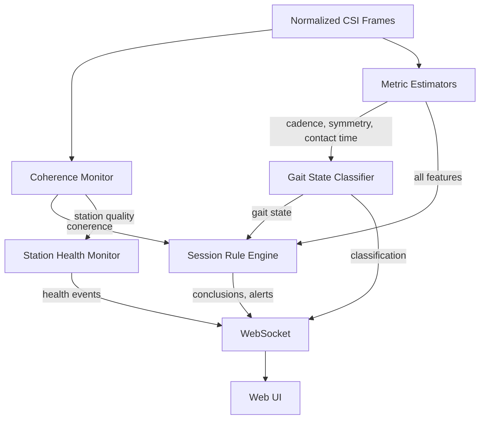

# Architecture

## System Overview

## CSI Ingestion Pipeline

## Realtime Inference Flow

## Service Boundaries

| Service | Responsibility | Does NOT own |
|---------|---------------|--------------|
| **firmware/** | CSI collection, serial output, OTA updates | Domain logic, persistence |
| **apps/gateway/** | Ingestion, signal processing, realtime metrics, vital signs, autonomous edge intelligence, local recording, WebSocket streaming, REST API | Long-term storage, auth |
| **apps/backend/** | Domain data, auth, persistence, validation, reports | Realtime processing, serial I/O |
| **apps/web/** | UI, visualization, user interaction | Business rules, signal processing |
| **ml/** | Training, evaluation, model export, quantization | Runtime serving (gateway handles inference) |

## Data Flow

1. **ESP32 TX** generates controlled Wi-Fi traffic
2. **ESP32 RX** captures CSI and emits CSV lines over serial
3. **Gateway** parses, normalizes, buffers, estimates metrics, optionally infers pose
4. **Gateway** streams to **Web UI** via WebSocket and pushes batches to **Backend** via HTTP
5. **Backend** persists sessions, metrics, validation runs, reports in **PostgreSQL**
6. **Web UI** renders dashboards, live sessions, replay, reports, and optional inferred motion views

## Inference Architecture Decision

The gateway integrates inference via an adapter pattern:

- **Signal processing**: Hampel filter, phase unwrapping, bandpass IIR, subcarrier selection, Body Velocity Profile — all in TypeScript
- **Proxy metrics**: computed directly in TypeScript from CSI feature windows
- **Vital signs**: breathing BPM and heart rate BPM estimated from CSI phase via FFT peak detection (experimental)
- **Pose inference**: delegated to a Python service via HTTP or loaded as ONNX in Node.js
- **REST API**: GET endpoints at `/api/v1/sensing/*` for polling access to latest metrics, vital signs, and signal quality

For v1, proxy metrics and vital signs run in-process. Pose inference uses a mock adapter that generates demo skeletal data, clearly marked as synthetic.

## API Surface

### WebSocket Events (Socket.IO, namespace `/live`)

| Event | Direction | Description |
|-------|-----------|-------------|
| `metrics` | server → client | Realtime proxy metrics at ~10 Hz |
| `vital-signs` | server → client | Breathing + heart rate estimates at ~1 Hz |
| `inferred-motion` | server → client | Inferred pose/skeleton frames |
| `treadmill-state` | server → client | Treadmill speed/incline changes |
| `connection-ack` | server → client | Connection acknowledgment with gateway version |
| `set-treadmill` | client → server | Manual speed/incline update |
| `start-protocol` | client → server | Start a treadmill protocol |
| `stop-protocol` | client → server | Stop current protocol |

### REST Endpoints (Gateway)

| Method | Path | Description |
|--------|------|-------------|
| GET | `/health` | System health check with pipeline status |
| GET | `/api/v1/sensing/latest` | Latest metric snapshot |
| GET | `/api/v1/sensing/vital-signs` | Breathing + heart rate estimates |
| GET | `/api/v1/sensing/signal-quality` | Signal quality details |
| GET | `/api/v1/sensing/status` | Sensing pipeline status summary |

### REST Endpoints (Gateway — Demo Mode Only)

| Method | Path | Description |
|--------|------|-------------|
| GET | `/api/v1/demo/status` | Current simulation state |
| POST | `/api/v1/demo/profile` | Switch athlete profile |
| POST | `/api/v1/demo/protocol` | Start a treadmill protocol |
| POST | `/api/v1/demo/fatigue` | Set fatigue rate (0–1) |
| POST | `/api/v1/demo/noise` | Set signal noise level |
| POST | `/api/v1/demo/reset` | Reset simulation to zero |
| GET | `/api/v1/demo/profiles` | List available athlete profiles |
| GET | `/api/v1/demo/protocols` | List available protocols |

## Demo Simulation Mode

For development and testing without physical ESP32 hardware, the gateway supports
a full simulation mode activated by `DEMO_MODE=true`.

Key characteristics:
- **Injected via `@Optional()`** — production code has zero awareness of demo logic
- **Physiological models** — gait, breathing, heart rate adapt to speed/incline/fatigue
- **Three athlete profiles** — elite, recreational, rehab patient
- **Three protocols** — progressive 5K, VO₂ max ramp, interval training
- **Dual control** — REST API (`/api/v1/demo/*`) and WebSocket (`demo-control` events)
- **Animated pose** — 17 COCO keypoints phase-locked to gait cycle

See [docs/demo-mode.md](demo-mode.md) for full usage guide.

## Session Replay

Replay loads persisted metric series and optional inferred motion series from the backend, rendering them with confidence overlays and stage markers.

## Autonomous Edge Intelligence

The gateway runs four autonomous edge modules adapted from quantum-inspired and
autonomous systems research (RuView):

### Coherence Monitor
Maps CSI subcarrier phases onto a Bloch sphere representation. Computes aggregate
coherence [0,1] and Von Neumann entropy. Detects environmental disturbances
(person walking near station, door opening, equipment interference) via sudden
entropy spikes (decoherence events). Feeds coherence into signal quality and the
session rule engine.

### Gait State Classifier
Grover-inspired multi-hypothesis classifier that maintains 8 weighted gait states
(idle, warming up, steady running, high intensity, fatiguing, form degrading,
cooling down, resting). Uses oracle boost/dampen + diffusion reflection to converge
on the most likely state from noisy CSI evidence. More robust than simple threshold
classifiers because hypotheses compete via probability amplification.

### Session Rule Engine
Forward-chaining symbolic rule engine with 12 biomechanics-specific rules. Interprets
CSI-derived metrics + coherence + gait state into autonomous conclusions and alerts
(fatigue onset, form degradation, environmental interference, steady state, speed
transition). Includes contradiction resolution for mutually exclusive conclusions.

### Station Health Monitor
Monitors health of multiple sensing stations (up to 8) using Stoer-Wagner min-cut
on a quality-weighted graph. Detects degraded stations and triggers reconfiguration
events. Hysteresis state machine prevents flapping between healthy and healing states.

### WebSocket Events (Autonomous)

| Event | Direction | Frequency | Description |
|-------|-----------|-----------|-------------|
| `autonomous-state` | server → client | ~2 Hz | Coherence, gait classification, rule conclusions |
| `station-health` | server → client | ~1 Hz | Multi-station health and coverage |
| `recording-status` | server → client | on change | Local recording start/stop status |
| `start-recording` | client → server | manual | Begin local CSI capture |
| `stop-recording` | client → server | manual | End local CSI capture |

## Local CSI Recording

The gateway supports offline recording of raw CSI frames to local disk in NDJSON
(newline-delimited JSON) format. This enables session capture when the backend is
unavailable and provides raw data for later analysis.

Files are stored in `storage/captures/{session-id}/{timestamp}.ndjson` with automatic
rotation at 10 MB or 60 seconds.

## Firmware OTA Updates

The ESP32 RX node supports over-the-air firmware updates via the ESP-IDF
`esp_https_ota` API. Features:
- Periodic update checks (default: every 6 hours)
- Manual trigger via UART command `OTA:<url>`
- SHA256 firmware verification
- Progress reporting via serial heartbeat frames
- Automatic rollback on boot failure

## Pre-Trained Model Hub

See [docs/models.md](models.md) for the contrastive encoder, task heads, LoRA
station adapters, quantization pipeline, and HuggingFace integration.
