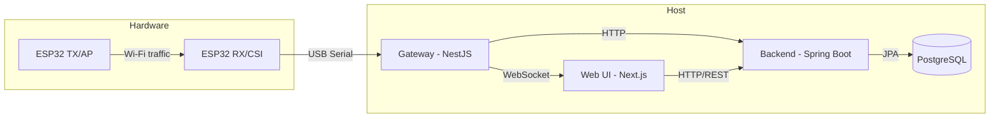
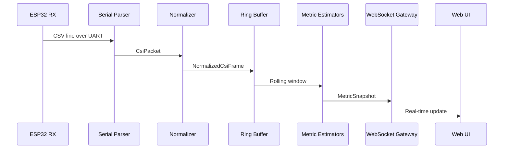
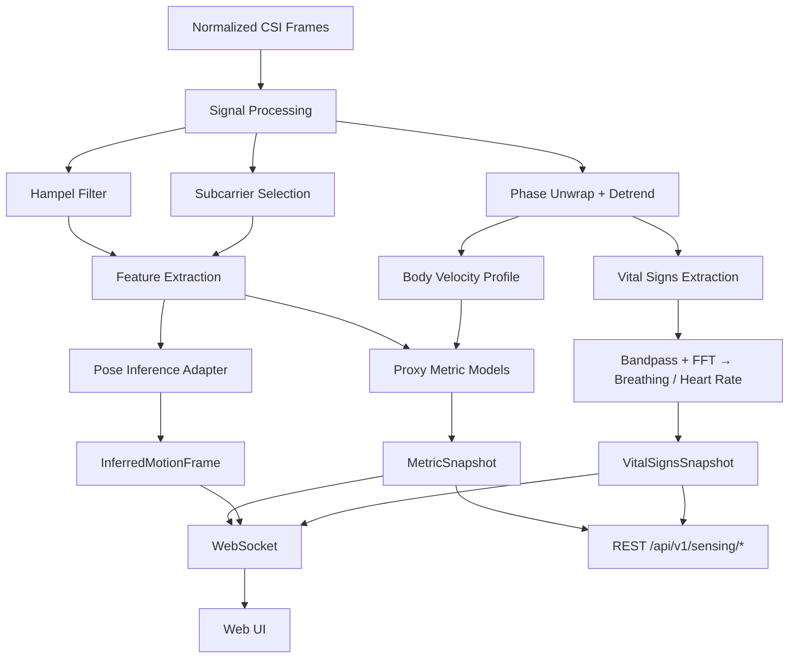
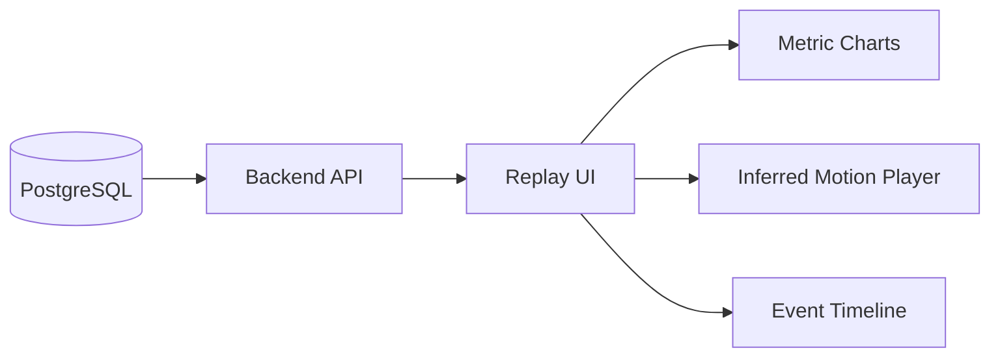

# Architecture

## System Overview

## CSI Ingestion Pipeline

## Realtime Inference Flow

## Service Boundaries

| Service | Responsibility | Does NOT own |
|---------|---------------|--------------|
| **firmware/** | CSI collection, serial output | Domain logic, persistence |
| **apps/gateway/** | Ingestion, signal processing, realtime metrics, vital signs, WebSocket streaming, REST API | Long-term storage, auth |
| **apps/backend/** | Domain data, auth, persistence, validation, reports | Realtime processing, serial I/O |
| **apps/web/** | UI, visualization, user interaction | Business rules, signal processing |
| **ml/** | Training, evaluation, model export | Runtime serving (gateway handles inference) |

## Data Flow

1. **ESP32 TX** generates controlled Wi-Fi traffic
2. **ESP32 RX** captures CSI and emits CSV lines over serial
3. **Gateway** parses, normalizes, buffers, estimates metrics, optionally infers pose
4. **Gateway** streams to **Web UI** via WebSocket and pushes batches to **Backend** via HTTP
5. **Backend** persists sessions, metrics, validation runs, reports in **PostgreSQL**
6. **Web UI** renders dashboards, live sessions, replay, reports, and optional inferred motion views

## Inference Architecture Decision

The gateway integrates inference via an adapter pattern:

- **Signal processing**: Hampel filter, phase unwrapping, bandpass IIR, subcarrier selection, Body Velocity Profile — all in TypeScript
- **Proxy metrics**: computed directly in TypeScript from CSI feature windows
- **Vital signs**: breathing BPM and heart rate BPM estimated from CSI phase via FFT peak detection (experimental)
- **Pose inference**: delegated to a Python service via HTTP or loaded as ONNX in Node.js
- **REST API**: GET endpoints at `/api/v1/sensing/*` for polling access to latest metrics, vital signs, and signal quality

For v1, proxy metrics and vital signs run in-process. Pose inference uses a mock adapter that generates demo skeletal data, clearly marked as synthetic.

## API Surface

### WebSocket Events (Socket.IO, namespace `/live`)

| Event | Direction | Description |
|-------|-----------|-------------|
| `metrics` | server → client | Realtime proxy metrics at ~10 Hz |
| `vital-signs` | server → client | Breathing + heart rate estimates at ~1 Hz |
| `inferred-motion` | server → client | Inferred pose/skeleton frames |
| `treadmill-state` | server → client | Treadmill speed/incline changes |
| `connection-ack` | server → client | Connection acknowledgment with gateway version |
| `set-treadmill` | client → server | Manual speed/incline update |
| `start-protocol` | client → server | Start a treadmill protocol |
| `stop-protocol` | client → server | Stop current protocol |

### REST Endpoints (Gateway)

| Method | Path | Description |
|--------|------|-------------|
| GET | `/health` | System health check with pipeline status |
| GET | `/api/v1/sensing/latest` | Latest metric snapshot |
| GET | `/api/v1/sensing/vital-signs` | Breathing + heart rate estimates |
| GET | `/api/v1/sensing/signal-quality` | Signal quality details |
| GET | `/api/v1/sensing/status` | Sensing pipeline status summary |

## Session Replay

Replay loads persisted metric series and optional inferred motion series from the backend, rendering them with confidence overlays and stage markers.
