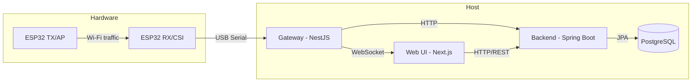
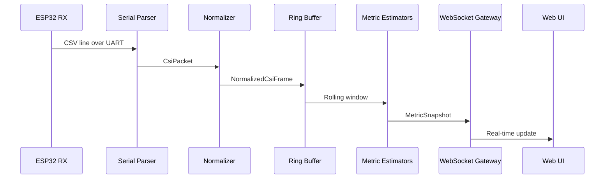
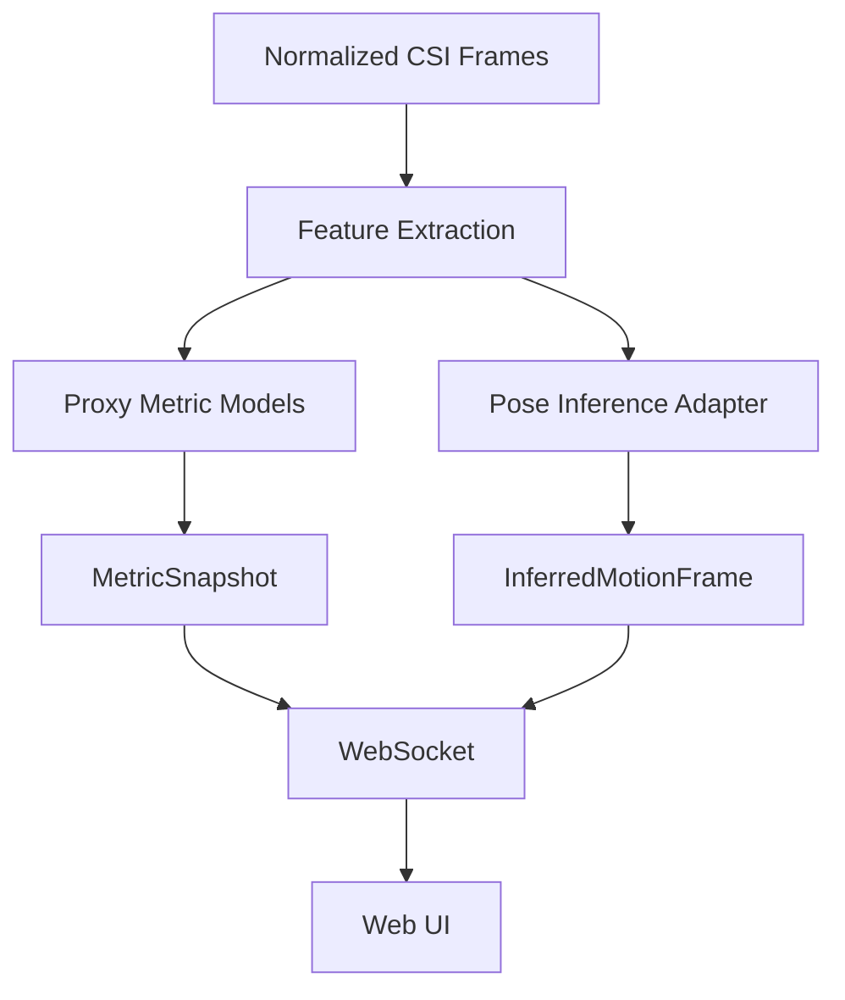
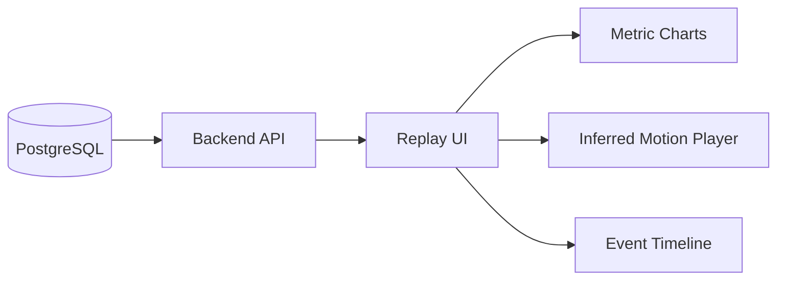

# Architecture

## System Overview

## CSI Ingestion Pipeline

## Realtime Inference Flow

## Service Boundaries

| Service | Responsibility | Does NOT own |
|---------|---------------|--------------|
| **firmware/** | CSI collection, serial output | Domain logic, persistence |
| **apps/gateway/** | Ingestion, realtime metrics, WebSocket streaming | Long-term storage, auth |
| **apps/backend/** | Domain data, auth, persistence, validation, reports | Realtime processing, serial I/O |
| **apps/web/** | UI, visualization, user interaction | Business rules, signal processing |
| **ml/** | Training, evaluation, model export | Runtime serving (gateway handles inference) |

## Data Flow

1. **ESP32 TX** generates controlled Wi-Fi traffic
2. **ESP32 RX** captures CSI and emits CSV lines over serial
3. **Gateway** parses, normalizes, buffers, estimates metrics, optionally infers pose
4. **Gateway** streams to **Web UI** via WebSocket and pushes batches to **Backend** via HTTP
5. **Backend** persists sessions, metrics, validation runs, reports in **PostgreSQL**
6. **Web UI** renders dashboards, live sessions, replay, reports, and optional inferred motion views

## Inference Architecture Decision

The gateway integrates inference via an adapter pattern:

- **Proxy metrics**: computed directly in TypeScript from CSI feature windows
- **Pose inference**: delegated to a Python service via HTTP or loaded as ONNX in Node.js

For v1, proxy metrics run in-process. Pose inference uses a mock adapter that generates demo skeletal data, clearly marked as synthetic.

## Session Replay

Replay loads persisted metric series and optional inferred motion series from the backend, rendering them with confidence overlays and stage markers.
