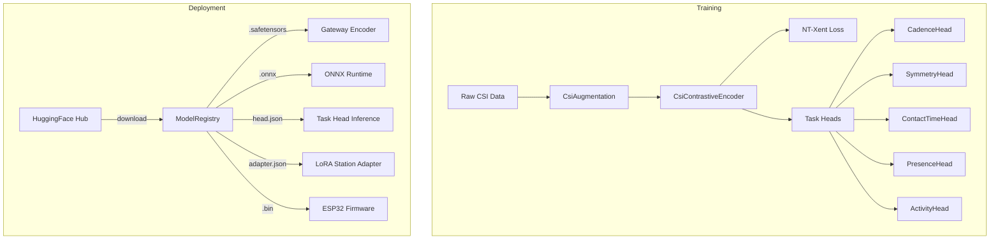

# Pre-Trained Model Hub

## Overview

The platform includes a pre-trained model hub that supports downloading, caching,
composing, and deploying CSI-based contrastive encoders with swappable task heads,
per-station LoRA adapters, and quantized firmware variants.



## Architecture

### Contrastive Encoder

**Module**: `ml/src/biomech_ml/contrastive.py`

The `CsiContrastiveEncoder` produces 128-dimensional L2-normalized embeddings from
CSI amplitude/phase windows. It reuses `ResidualConv1dBlock` from the backbone model.

**Architecture**:
- Input: `(batch, 2, window_size, num_subcarriers)` — amplitude + phase channels
- Reshape: `(batch, 2 * num_subcarriers, window_size)` — flattened for 1D convolution
- Backbone: 3× ResidualConv1dBlock (conv_in → 128 → d_model → d_model)
- Pool: AdaptiveAvgPool1d → (batch, d_model)
- Projection: Linear(d_model → 256) → ReLU → Linear(256 → 128) → L2 normalize

**Self-supervised training**: Positive pairs are created from the same CSI window
via `CsiAugmentation` (time shift, subcarrier dropout, Gaussian noise, amplitude
scaling). The NT-Xent loss (temperature=0.07) pulls positives together and pushes
negatives apart in embedding space.

**Key properties**:
- Embedding dimension: 128
- Embeddings are unit vectors (L2-normalized)
- No task-specific labels needed for pre-training

### Task Heads

**Module**: `ml/src/biomech_ml/heads.py`

Task heads are lightweight networks (Linear → ReLU → Linear) that consume the
128-dim encoder embedding and produce task-specific outputs.

| Head | Output | Range | Description |
|------|--------|-------|-------------|
| `CadenceHead` | 1 scalar | [0, ∞) SPM | Estimated cadence in steps per minute |
| `SymmetryHead` | 1 scalar | [0, 1] | Left/right gait symmetry proxy |
| `ContactTimeHead` | 1 scalar | [0, 1] | Ground contact time proxy |
| `PresenceHead` | 1 scalar | [0, 1] | Binary presence detection confidence |
| `ActivityHead` | N logits | softmax | Activity class (walking, running, sprinting, stationary) |

Heads are serialized as JSON with base64-encoded weights, making them small (~KB)
and easy to swap without touching the encoder.

### LoRA Station Adapters

**Module**: `ml/src/biomech_ml/lora.py`

LoRA (Low-Rank Adaptation) allows per-station fine-tuning of the encoder without
modifying the base weights. Each adapter is a pair of low-rank matrices (rank 4–16)
that modify the projection layers.

**Key design**:
- Base encoder stays **frozen** (shared across all stations)
- Only LoRA matrices are trainable and station-specific
- Stored as JSON with station metadata (station_id, calibration_date)
- Typical size: ~2–10 KB per adapter

This accounts for per-station environment: treadmill placement, wall proximity,
nearby equipment, AP antenna orientation.

### Quantization Pipeline

**Module**: `ml/src/biomech_ml/quantize.py`

For ESP32 on-device inference, models are quantized to reduced precision:

| Format | Bits | Target Size | Description |
|--------|------|-------------|-------------|
| INT8 | 8-bit | ~48 KB | Standard quantization, state dict serialization |
| INT4 | 4-bit | ~8 KB | Grouped 4-bit with zero-points |
| INT2 | 2-bit | ~4 KB | Ternary quantization (-1, 0, +1) |

Each quantized binary includes a `.meta.json` with:
- `model_hash`: SHA256 provenance hash of the source model
- `bits`: quantization level
- `size_bytes`: file size
- `exported_at`: ISO timestamp

### Model Registry

**Module**: `ml/src/biomech_ml/hub.py`

The `ModelRegistry` class manages model lifecycle:

1. **Download**: Fetches pre-trained models from HuggingFace (`rjamoriz/biomech-csi`)
2. **Cache**: Stores in `storage/models/` with automatic directory management
3. **Load**: Instantiates encoders from `.safetensors`, heads from `.json`, adapters from `.json`
4. **List**: Scans cache for all available model artifacts

```python
from biomech_ml.hub import ModelRegistry

registry = ModelRegistry()
registry.download_pretrained()

# Load encoder
encoder = registry.load_encoder(num_subcarriers=64, window_size=64, d_model=64)

# Load task head
cadence_head = registry.load_head("cadence")

# Load station adapter
adapter = registry.load_station_adapter("station-001", encoder)
```

## Gateway Integration

**Module**: `apps/gateway/src/inference/model-registry.service.ts`

The gateway `ModelRegistryService` scans `storage/models/` at startup and resolves
models by priority:

1. `biomech-encoder.onnx` (contrastive encoder ONNX export)
2. `csi_pose_net.onnx` (legacy pose model)
3. No model (graceful degradation)

The `OnnxInferenceService` uses the registry to find the best available model path,
falling back to mock predictions when no model is available.

## Training Workflows

### Self-Supervised Pre-Training

```bash
make train-contrastive
# or directly:
cd ml && python -m biomech_ml.train_contrastive \
    --data-dir storage/raw/ \
    --epochs 100 \
    --batch-size 64 \
    --lr 3e-4
```

### Task Head Training

```bash
make train-heads
# Trains all heads on labeled session data
```

### Quantization

```bash
make quantize
# Exports INT8, INT4, INT2 binaries to storage/models/
```

### Benchmarking

```bash
make benchmark-ml
# Reports embeddings/sec, ms per embedding, parameter count
```

### Model Download

```bash
make download-models
# Downloads from HuggingFace rjamoriz/biomech-csi
```

## File Layout

```
storage/models/
├── biomech-encoder.safetensors    # Pre-trained contrastive encoder
├── biomech-encoder.onnx           # ONNX export for gateway inference
├── cadence-head.json              # Task head: estimated cadence
├── symmetry-head.json             # Task head: symmetry proxy
├── contact-time-head.json         # Task head: contact-time proxy
├── presence-head.json             # Task head: presence detection
├── activity-head.json             # Task head: activity classification
├── station-001-adapter.json       # LoRA adapter for station 001
├── biomech-int8.bin               # 8-bit quantized for edge
├── biomech-int8.meta.json
├── biomech-int4.bin               # 4-bit quantized for ESP32
├── biomech-int4.meta.json
├── biomech-int2.bin               # 2-bit ternary for ESP32
└── biomech-int2.meta.json
```

## Scientific Honesty

All model outputs are **estimated** or **inferred**, never exact:
- Task head outputs carry the encoder's confidence + signal quality context
- Quantized models may have reduced accuracy — validation status tracks this
- LoRA adapters are station-specific and do not transfer across installations
- The contrastive encoder learns CSI representations, not optical features

Validation states apply to model-derived metrics:
- `unvalidated` — no external reference comparison
- `experimental` — internal testing only
- `station-validated` — validated at a specific station with known reference
- `externally-validated` — validated against IMU, force plate, or video reference

## Tests

| Test File | Coverage |
|-----------|----------|
| `ml/tests/test_contrastive.py` | Encoder output shape, L2 norm, NT-Xent loss, augmentation, safetensors roundtrip, ONNX export |
| `ml/tests/test_heads.py` | Per-head output, sigmoid bounds, JSON serialization roundtrip |
| `ml/tests/test_lora.py` | Adapter behavior, frozen encoder, station adapter JSON persistence |
| `ml/tests/test_quantize.py` | INT8/4/2 sizes, binary export, provenance metadata, deterministic hash |
| `ml/tests/test_hub.py` | Registry init, model listing, encoder/head loading, error handling |
